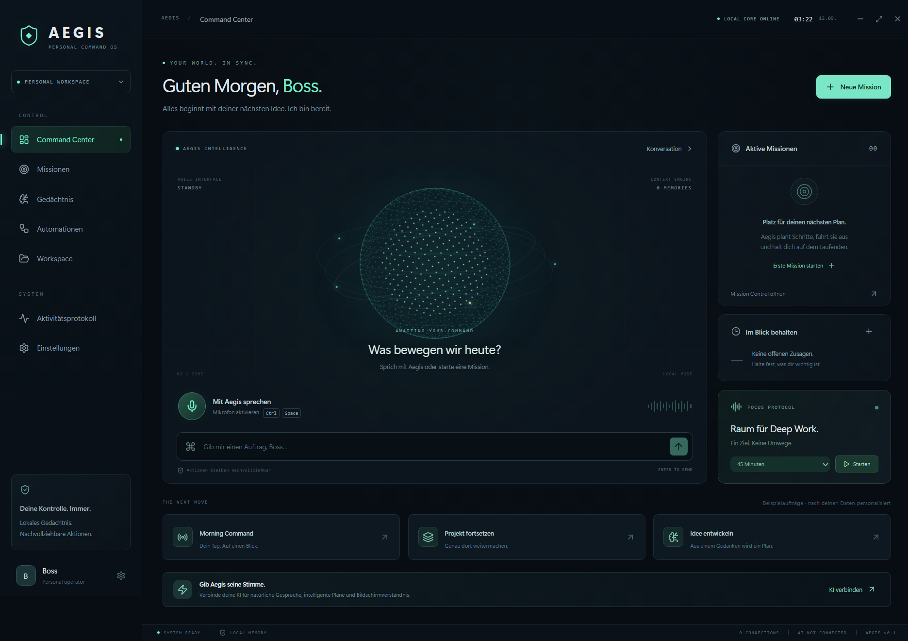

# AEGIS · Personal Command OS

Dein persönliches Command Center für Windows. Stimme, Projektgedächtnis und nachvollziehbare Aktionen – mit einer Oberfläche, die nach Zukunft aussieht.

**Status: Version 0.6.0, kein universeller autonomer Computer-Agent.** Lokale Funktionen sind ohne KI nutzbar. Live-Sprache, freie KI-Aufträge und Kontodaten benötigen eigene Zugangsdaten. Die App enthält keine Beispieldaten und keine vorgetäuschten Verbindungen.

0.6.0 ergänzt sichtbare Sprachsteuerung der App: „Öffne die Einstellungen“, „Geh zu Missionen“, „Öffne Chrome“ und „Gespräch beenden“. Die Sprache bleibt beim Seitenwechsel bestehen; außerhalb des Command Centers zeigt die Kopfleiste den Mikrofonstatus. Der Plugin-Zugang wird jetzt getrennt vom Katalog und von Microsoft Graph geprüft. **Plugins → Outlook Email → Verbindung testen** liest nur das Kontoprofil und zeigt die bestätigte Adresse. E-Mail-Abrufe laufen über begrenzte direkte Werkzeuge, ohne zusätzlichen KI-Agenten; Sende-, Lösch- und Weiterleitungswerkzeuge werden nicht aufgerufen. [Details und Prüfschritte](docs/PLUGINS.md).

0.5.1 behebt den Sprachstartfehler `Unknown parameter: session.tools[6].strict`: Responses-spezifische Werkzeugmetadaten werden nicht mehr an die Realtime-Sitzung übertragen. Ein Regressionstest prüft jedes Realtime-Werkzeug.

0.5.0 ergänzt **Plugin Control** mit dem offiziellen Codex-/ChatGPT-Plugin-Katalog. Für privates Hotmail ist `Outlook Email` nun der empfohlene Weg ohne eigene Azure-Appregistrierung: Tageslagebild, scrollbar geladene Nachrichten, Belege und ein kontrollierter Antwortablauf. Aegis formuliert lokal, du prüfst und bearbeitest, ein bewusster Klick speichert nur einen Outlook-Entwurf; **Senden bleibt ausschließlich in Outlook bei dir**. [Plugin-Einrichtung und Grenzen](docs/PLUGINS.md).

0.4.0 ergänzt den standardmäßig aktiven **Kostenwächter**, echte Realtime-Tokenmessung, das konsequente Meister-Protokoll sowie **Inbox Intelligence** für ein verbundenes Outlook-/Hotmail- oder Gmail-Postfach. Die Rechercheansicht zeigt ihren tatsächlichen Anfrage-, Quellen- und Evidenzpfad animiert. [Kosten und sinnvolle Modelle](docs/KOSTEN.md).

0.3.0 ergänzt den **Live Desk**: Sprachkern links, rechts Wetter mit Globus/Stundenansicht, interaktive Ortskarte, Währungs-/Kryptodiagramme und Recherche mit Quellen im App-Fenster. Wetter und Kurse verwenden öffentliche Datenquellen ohne zusätzliche Schlüssel. Recherche nutzt Tavily oder die OpenAI-Websuche (Zusatzkosten). [Anleitung, Sprachbeispiele und Grenzen](docs/LIVE-DESK.md).

0.2.0 macht Sprache zur Hauptansicht: automatische Begrüßung beim Öffnen, ein auf empfangenes Audio reagierender Kern und ein optional ausklappbarer Chat. Aegis kennt seinen lokalen App-/Verbindungsstatus und erklärt fehlende Einrichtung. Eine Microsoft-Anleitung trennt App-Registrierung und Postfach-Anmeldung; sie ersetzt keine eigene OAuth-Registrierung.

0.1.1 behebt den Sprachstartfehler `failed to unmarshal SDP: EOF`: WebRTC-Angebote werden inklusive abschließendem CRLF unverändert übertragen. Ein Regressionstest prüft den tatsächlichen Multipart-Inhalt. Zum Aktualisieren die alte App über das Tray-Menü vollständig beenden; Einstellungen werden nicht zurückgesetzt.



## In drei Schritten starten

1. Für einen festen App-Pfad `release/win-unpacked/Aegis.exe` starten (den ganzen Ordner zusammenlassen). Alternativ `Aegis-0.6.0-Windows.exe` als selbstentpackende Einzeldatei. Keine Node-Installation nötig. Der persönliche Build ist nicht code-signiert; Windows kann einen unbekannten Herausgeber melden. Herkunft prüfen, keine Windows-Schutzfunktionen abschalten.
2. **Einstellungen → KI-Verbindung:** eigenen OpenAI API-Schlüssel eintragen, speichern und „KI-Verbindung testen“ wählen. Ein ChatGPT-/Codex-Abo ersetzt kein API-Guthaben. Den Schlüssel nur in der App eingeben, niemals in GitHub oder einen Chat kopieren.
3. **Workspace:** einen konkreten Projektordner freigeben. Mit eingerichtetem OpenAI-Zugang beginnt in der Desktop-App automatisch die Sprachbegrüßung. Für Texteingaben „Chat anzeigen“ wählen. Weitere Konten unter Einstellungen → Verbindungen einrichten.

Mit **Ctrl + Space** schaltest du die Sprache in Aegis um. **Ctrl + Shift + Space** öffnet Aegis systemweit und schaltet die Sprache um. Das Kreuz schließt das Fenster in den Tray; über das Tray-Menü → „Aegis beenden“ wird die App vollständig beendet. Autostart ist optional und muss in Einstellungen aktiviert werden.

**Mikrofon und Kosten:** „Beim Öffnen begrüßen & zuhören“ ist standardmäßig an, auch nach diesem Update. Bei eingerichtetem OpenAI-Zugang aktiviert es beim Laden der Desktop-App das Mikrofon und eine kostenpflichtige Realtime-Sitzung. In Einstellungen abschaltbar. Escape oder der Sprachknopf beendet die Sitzung; nach spätestens 15 Minuten wird sie automatisch beendet. Kein automatischer Neustart nach Abbruch oder Fehler. Die Begrüßung kennt lokale Einstellungen und gespeicherte Aufgaben, behauptet aber keine gerade erfolgte Mail-/Kalenderprüfung.

## Was daran mehr ist als ein Sprachchat

| Funktion              | Tatsächliche Umsetzung                                                                                                                                                                         |
| --------------------- | ---------------------------------------------------------------------------------------------------------------------------------------------------------------------------------------------- |
| Mission Control       | Ziel in konkrete Werkzeugschritte zerlegen; Schrittstatus, Parameter, Ergebnisse und Freigaben persistent speichern. Keine automatische Wiederholung unklarer Schreibaktionen.                 |
| Projektgedächtnis     | Eigene Notizen, Entscheidungen und Präferenzen speichern und durchsuchen; beim KI-Gespräch als Kontext nutzen.                                                                                 |
| Commitment Radar      | Zusagen, Personen und Fälligkeiten erfassen, in Briefings verwenden und erledigen.                                                                                                             |
| Automationen          | Wiederkehrende Aufträge in wählbaren Intervallen; laufen, solange Aegis auf einem wachen Computer geöffnet ist. Kein Duplizieren einer noch auf Freigabe wartenden Routine.                    |
| Shadow Mode           | Explizit gestartete Sitzung: aktive Fenstertitel unter Windows alle 7 Sekunden plus manuelle Notizen; daraus ein pausierter Routine-Entwurf. Keine Tasten, Bilder oder Passwörter aufzeichnen. |
| Screen Wingman        | Ein vom Nutzer ausgewähltes Fenster-/Bildschirmbild einmalig zur KI übertragen und analysieren; Bilder werden nicht in Aegis gespeichert.                                                      |
| Browser Operator      | Eigener sichtbarer Browser: HTTP(S)-Seiten öffnen, Text/Elemente lesen, konkrete Felder ausfüllen und klicken. URL, Elementlabel und Text müssen freigegeben werden.                           |
| Verifizierte Berichte | Neue Markdown-Dateien ausschließlich in `Aegis Reports` des ausgewählten Workspaces; kein Überschreiben. Rückgängig verschiebt unveränderte Berichte in `.aegis-undo`.                         |
| Focus Sprint          | Optionaler lokaler Timer mit Desktop-Hinweis am Ende. Andere Apps oder Benachrichtigungen werden nicht blockiert.                                                                              |
| Inbox Intelligence    | Tageslagebild plus scrollbares Outlook-/Hotmail- oder Gmail-Postfach als Belegkarten; sichtbarer, bearbeitbarer Antwortentwurf. Kein automatisches Senden.                                     |
| Plugin Control        | Offizieller Codex-/ChatGPT-Katalog mit Suche, Status und Anbieter-Anmeldung für Outlook, Kalender, Dateien, Aufgaben, Entwicklung und weitere Fähigkeiten.                                     |
| Nachvollziehbarkeit   | Lokales Aktivitätsprotokoll, explizite Fehler und getrennte Angaben „angefordert“, „erstellt“ und „verifiziert“.                                                                               |

### Ideen für erste Aufträge

- „Merke dir: Projekt Atlas braucht noch einen Design-Review.“ **Ohne API möglich.**
- „Erinnere Atlas“, „Fokus 25“, „Briefing“, „Suche Angebot“ oder „Bericht erstellen“. **Ohne API möglich.**
- „Suche im Projektordner nach Atlas, vergleiche das mit meinen gespeicherten Notizen und schlage die nächsten drei Schritte vor.“ **Mit KI.**
- „Prüfe meine ungelesenen Mails und die Termine dieser Woche. Was sollte ich zuerst erledigen? Erstelle nur Entwürfe für Antworten.“ **Mit KI + Google/Microsoft.**
- „Finde aktuelle Quellen zu meiner Produktidee und bereite ein GitHub-Issue mit den nächsten Schritten vor.“ **Mit KI + Tavily + GitHub.**
- „Lege eine stündliche Routine mit dem Auftrag ‚Briefing‘ an.“ **Mit KI; Einrichtung zur Freigabe.**
- „Lies meine Smart-Home-Geräte und schalte das Schreibtischlicht ein.“ **Mit KI + Home Assistant; Schalten zur Freigabe.**

Bei Aufgaben, die Informationen aus vorherigen Schritten benötigen, zuerst den Chat verwenden: Er kann Werkzeugergebnisse in den nächsten KI-Aufruf übernehmen. Der separate Missionsplaner verlangt bereits konkrete Argumente und fragt bei fehlenden IDs/Daten nach. Nach einer Freigabe kann der Chat mit `mission_status` das echte Ergebnis nachlesen. Es gibt kein pauschales „alles automatisch erlauben“.

## Verbindungen

GitHub; Google Gmail, Kalender und Drive; Microsoft Outlook/Hotmail, Kalender und To Do; Home Assistant; Tavily-Websuche sowie der offizielle Plugin-Katalog. Für privates Hotmail zuerst **Control Panel → Plugins → Outlook Email** verwenden; dafür ist keine eigene Azure-Appregistrierung nötig. Die direkte Microsoft-Graph-Verbindung bleibt als Entwickler-Alternative erhalten. [Plugin-Einrichtung](docs/PLUGINS.md) und [direkte Verbindungen](docs/VERBINDUNGEN.md).

E-Mails werden als **Entwürfe** erstellt, nicht automatisch versendet. Kalendertermine werden ohne Teilnehmer angelegt. Home Assistant ist auf `light`, `switch` und `scene` beschränkt; keine Schlösser oder Alarmanlagen. Browser-Passwort-/Zahlungsfelder und kritische Aktionen sind ausgeschlossen; Anmeldung erfolgt durch dich. Nicht jede Website ist automatisierbar. Kein beliebiger Shell-Zugriff, kein WhatsApp-/Spotify-Connector und keine Hintergrundüberwachung bei ausgeschaltetem PC.

## KI, Kosten und Datenschutz

Voreinstellungen: `gpt-4.1-mini` für Text/Vision und `gpt-realtime-mini` mit Stimme `cedar` für Sprache. Der Kostenwächter begrenzt den aktiven Sprachkontext, hält Antworten kurz und reduziert maximale Text-/Rechercheausgaben; das lokale Langzeitgedächtnis bleibt erhalten. Modelle sind konfigurierbar; der Account muss Zugriff darauf haben. Das tägliche Limit zählt API-Aufrufe inklusive Sprach-Verbindungsstarts, **nicht Euro oder Gesprächsminuten**. Aegis zeigt gemeldete Text-, Audio- und Cache-Tokens, aber keine erfundene verbindliche Rechnung. [Details und aktuelle offizielle Preisquellen](docs/KOSTEN.md).

Alternativ: **Ollama** für lokale Text-KI auf `http://127.0.0.1:11434`, mit einem installierten toolfähigen Modell, beispielsweise `qwen3:8b`. Ollama und das Modell sind nicht mitgeliefert. Qualität und Werkzeugfähigkeit hängen vom Modell ab. Live-Sprache und Screen Wingman benötigen in dieser Version OpenAI.

Bei verfügbarer Windows-Verschlüsselung schützt Electron `safeStorage` die gesamte Zustandsdatei und die Zugangsdaten. Die Daten sind an das Windows-Konto gebunden, nicht als portable Konten-Backups gedacht. Fehlt dieser Schutz, warnt die App: **Zugangsdaten nur im Arbeitsspeicher, lokale Inhalte unverschlüsselt**. Private Inhalte erst nach Prüfung des Schutzstatus hinterlegen.

Bei Cloud-KI werden Aufträge, relevante Erinnerungen und verwendete Werkzeugergebnisse zum Anbieter übertragen; bei Sprache Audio und bei Screen Wingman das ausdrücklich gewählte Bild. „Lokal gespeichert“ bedeutet nicht „bleibt bei Cloud-KI immer auf diesem Computer“. Keine eigene Telemetrie. [Architektur, Grenzen und Testnachweise](docs/TECHNIK.md).

## Entwicklung

Windows 10/11 x64, Node.js 22+, npm.

```sh
npm ci
npm test
npm run build
npm start
```

`npm run dev` startet Vite und die Electron-App. `npm run preview` startet nach dem Build eine lokale Browser-Vorschau auf `http://127.0.0.1:4173`; native Funktionen fehlen dort und Schlüssel werden nicht dauerhaft gespeichert. Die Vorschau ist ausschließlich für lokale Entwicklung, nicht zum Hosten im Internet.

```sh
npm run test:desktop
npm run package
```

Das portable Ergebnis liegt in `release/Aegis-0.6.0-Windows.exe`, der feste App-Pfad in `release/win-unpacked/Aegis.exe`. Der GitHub-Workflow testet und baut das Windows-Paket; Build-Artefakte werden 14 Tage aufgehoben. Ein privater Build wird nicht automatisch öffentlich veröffentlicht. Keine automatischen Updates; neue Versionen bewusst herunterladen.

Für isolierte Tests kann `AEGIS_DATA_DIR` gesetzt werden. `OPENAI_API_KEY` wird alternativ beim Start übernommen, wenn kein Schlüssel gespeichert ist; `.env` wird nicht automatisch geladen. Keine echten Keys für Tests verwenden.

## Dokumentationsgrundlage

Die Sprachverbindung nutzt die serverseitige SDP-Schnittstelle der [OpenAI WebRTC-Dokumentation](https://developers.openai.com/api/docs/guides/voice-webrtc). Funktionsaufrufe nutzen die [Responses Function-Calling-Schnittstelle](https://developers.openai.com/api/docs/guides/function-calling); das konfigurierbare [Realtime-Mini-Modell](https://developers.openai.com/api/docs/models/gpt-realtime-mini) ist separat dokumentiert. API-Key und Kontoverbindungen sind nicht im Repository enthalten.
